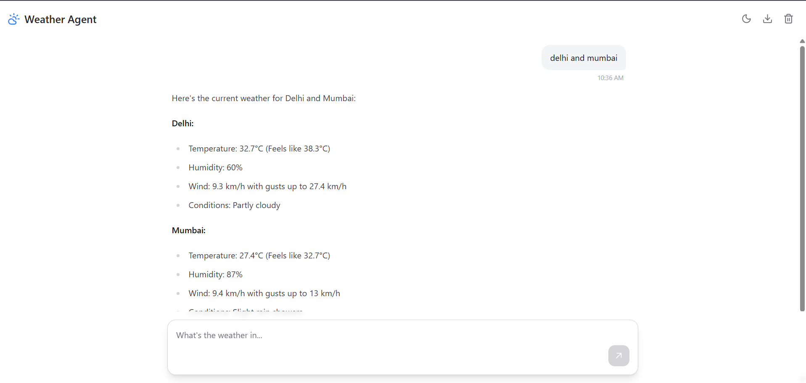

# Weather Agent Chat Interface



*A responsive, real-time chat interface built with React and Tailwind CSS that connects to a streaming weather agent API. This project fulfills the requirements of the Frontend Engineer Assignment.*


## Features

-   **Real-time Streaming:** Displays the agent's response as it's generated, token by token.
-   **Full Conversation History:** Keeps track of the entire chat session.
-   **Dark/Light Mode:** Seamless theme toggling with automatic style adjustments.
-   **Chat Management:** Functionality to clear the entire chat history.
-   **Export Chat:** Download the conversation history as a `.txt` file.
-   **Robust Error Handling:** Displays clear, user-friendly error messages for API failures.
-   **Responsive Design:** A mobile-first interface that works beautifully on all screen sizes.
-   **Modern UI/UX:** A clean, polished interface with smooth transitions and a focus on user experience.

---

## Tech Stack

-   **Framework:** React (Vite)
-   **Styling:** Tailwind CSS (with `@tailwindcss/typography` for markdown)
-   **Icons:** Lucide React
-   **API Communication:** Native `fetch` API with `ReadableStream`
-   **Build Tool:** Vite
-   **Language:** JavaScript

---

## Setup and Local Installation

To run this project locally, follow these steps:

1.  **Clone the repository:**
    ```bash
    git clone https://github.com/hemantsingh443/weatherapp.git
    cd weatherapp
    ```

2.  **Install dependencies:**
    ```bash
    npm install
    ```

3.  **Configure your `threadId`:**
    This is a critical step. Open the file `src/App.jsx` and replace the placeholder `12345` with your unique identifier (e.g., your college roll number).

    ```javascript
    // src/App.jsx
    const THREAD_ID = 12345; // <-- CHANGE THIS VALUE
    ```

4.  **Run the development server:**
    ```bash
    npm run dev
    ```
    The application will be available at `http://localhost:5173`.

---

## Approach & Technical Decisions

### 1. Component Architecture
The application is structured into reusable, single-responsibility components:
-   `App.jsx`: The main stateful component that manages conversation history, loading states, and API calls.
-   `Header.jsx`: A stateless component for the top bar, handling UI actions like theme toggling and chat management.
-   `ChatMessage.jsx`: A versatile component that renders messages differently based on their `role` (user vs. agent), providing distinct styling for each.
-   `ChatInput.jsx`: A controlled component for user input that handles dynamic resizing, disabled states, and submission events.

### 2. State Management
Standard React hooks (`useState`, `useEffect`, `useRef`) were chosen for state management. This approach is lightweight, performant, and sufficient for the complexity of this application, avoiding the overhead of larger state management libraries like Redux or Zustand.

### 3. API Integration & Streaming
All API communication is encapsulated within a dedicated service file (`src/services/weatherApi.js`). This separation of concerns makes the code cleaner and easier to maintain.

A key challenge was handling the API's custom streaming protocol. A parser function (`parseContentFromChunk`) was implemented to process the raw stream, filter out metadata chunks (e.g., `f:`, `9:`, `a:`), and extract only the user-facing message content (`0:"..."`). This ensures the UI displays a clean, continuous flow of text as intended.

### 4. Styling & Dark Mode
Tailwind CSS was used for its utility-first approach, which allows for rapid development and easy implementation of a responsive, mobile-first design. The `@tailwindcss/typography` plugin was leveraged to automatically style the agent's markdown responses beautifully.

Dark mode is implemented using Tailwind's `class` strategy, toggling a `.dark` class on the `<html>` element. This allows for all styling adaptations to be handled efficiently within the CSS.

---

## Assumptions Made

-   The `threadId` is a static value for the entire session. The application does not manage multiple threads.
-   The API's streaming protocol format is consistent and reliable. The parser is built specifically for the observed `0:"..."` content format.
-   Conversation history is not required to persist across page refreshes.

---

## Known Limitations & Future Improvements

-   **No Chat Persistence:** The conversation state is held in memory and is lost on refresh. Implementing `localStorage` would be a great next step to persist the session.
-   **Basic Error Handling:** The app currently shows a generic message for API errors. This could be improved to distinguish between network failures and specific HTTP error codes (e.g., 4xx vs. 5xx).
-   **Accessibility (a11y):** While basic ARIA labels are used, a comprehensive accessibility audit could be performed to ensure full compliance with WCAG standards.
-   **Testing:** The project currently lacks automated tests. Adding unit tests with Jest/React Testing Library for individual components and integration tests for the chat flow would improve code quality and reliability.